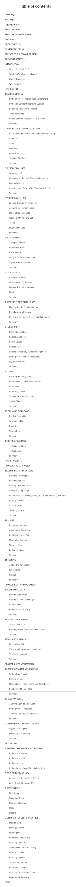
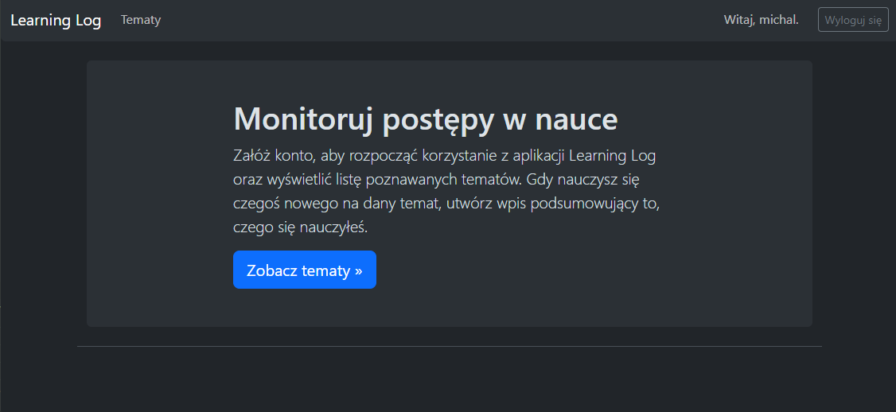
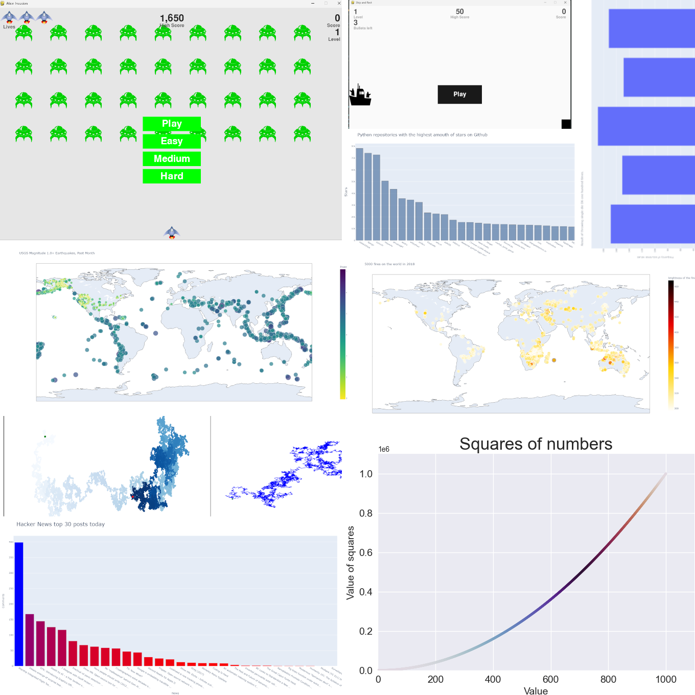

# Python Crash Course

It's my Python notes to that book in Polish version. It was hard and long journey but worth it.

## Table of contents

    Click to see!

### 

## [Learning Log](https://github.com/numbersanalyst/learning-log)

Through this course I created a modern Django web application with Bootstrap 5 styles. For more information, see my other repository for this project: [learning-log](https://github.com/numbersanalyst/learning-log).

## Exercises

I've done a tons of exercises to practice the knownleage on my own.

## Note
I've decided to skip some part of that book because it was boring for me. I've already learned it. So I think it's a little useless to learn something, that is easy for us.